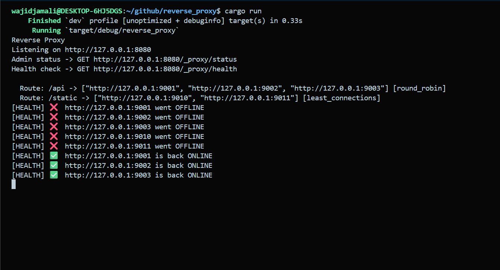

# Rust Reverse Proxy

A fast, lightweight reverse proxy server built in **Rust** using Actix-Web, that routes HTTP traffic across multiple backends with load balancing and automatic health checking.

---

## Demo



---

## Features

- **Request Routing:** Prefix based routing to direct traffic to the right backend group
- **Load Balancing:** Two strategies — Round Robin and Least Connections
- **Health Checks:** Automatic background checks every 10 seconds; unhealthy backends are removed from rotation and re-added when they recover
- **Header Forwarding:** Passes client headers to backends, injects X-Forwarded-For and X-Forwarded-Host
- **Admin Status API:** Real time view of all routes, backends, health, active connections, and success rates
- **Connection Tracking:** Tracks active connections per backend for Least Connections balancing

---

## Endpoints

### Proxy (catch-all)
All requests are matched by path prefix and forwarded to the appropriate backend pool.


### Admin

| Method | Path | Description |
|--------|------|-------------|
| GET | `/_proxy/health` | Proxy server health check |
| GET | `/_proxy/status` | Full status of all routes and backends |

### Status Response Example

```json
{
  "routes": [
    {
      "path_prefix": "/api",
      "strategy": "round_robin",
      "backends": [
        {
          "url": "http://127.0.0.1:9001",
          "healthy": true,
          "active_connections": 2,
          "total_requests": 145,
          "failed_requests": 1,
          "success_rate_percent": 99.31,
          "last_checked_secs_ago": 4
        }
      ]
    }
  ]
}
```

---

## Configuration

Routes are configured directly in `src/main.rs` inside the `main()` function:

```rust
let config = Config {
    routes: vec![
        Route {
            path_prefix: "/api".to_string(),
            strategy: "round_robin".to_string(),   // or "least_connections"
            backends: vec![
                "http://127.0.0.1:9001".to_string(),
                "http://127.0.0.1:9002".to_string(),
            ],
        },
    ],
};
```

**Load balancing strategies:**
- `round_robin` — distributes requests evenly across healthy backends in order
- `least_connections` — always picks the backend with fewest active connections

---

## Getting Started

### Prerequisites
- [Rust](https://rustup.rs/) (1.18+)

### Run

```bash
git clone git@github.com:abwajidjamali/rust-reverse-proxy.git
cd rust-reverse-proxy
cargo run
```

Proxy starts at `http://127.0.0.1:8080`

### Test with curl

```bash
# Health check
curl http://localhost:8080/_proxy/health

# View all backend statuses
curl http://localhost:8080/_proxy/status | jq .

# Send a proxied request (routes to /api backends)
curl http://localhost:8080/api/users
```

---

## Tech Stack

| Tool | Purpose |
|------|---------|
| [Rust](https://www.rust-lang.org/) | Language |
| [Actix-Web 4](https://actix.rs/) | HTTP server |
| [Reqwest](https://docs.rs/reqwest) | HTTP client for forwarding |
| [Tokio](https://tokio.rs/) | Async runtime & background tasks |
| [Serde](https://serde.rs/) | JSON serialization |

---
